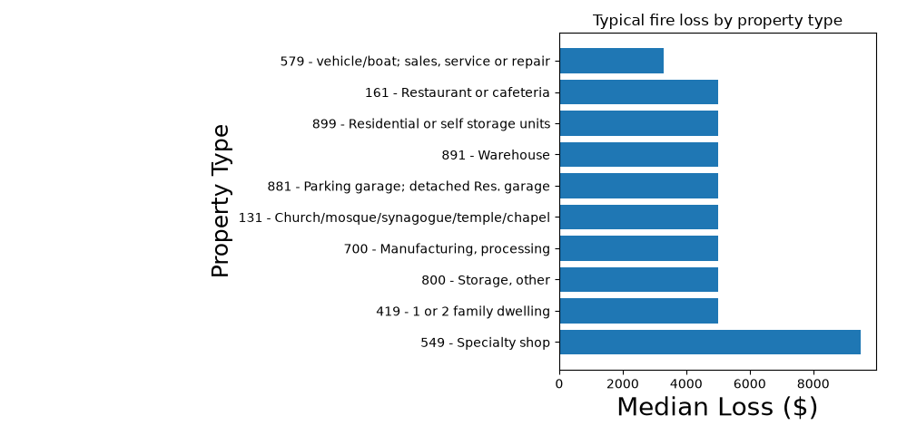

# Predicting San Franciso Fire Property Loss

This project predicts how much property damage a fire causes, using open data from San Franciso Fire Department

## What this project does 

The build estimates the dollar loss of a fire based on a few facts about the incident: what kind of property it was, what type of situation it was, and where in the building the fire started

Also made a chart answer a question: **Which types of properrty tend to have the most expensive fires?**

## The data
- **Source:** [San Franciso Open Data Portal - Fire Incidents](https://data.sfgov.org/Public-Safety/Fire-Incidents/wr8u-xric/about_data)
-**Size:** ~733,000 incidents, 66 columns
- **Target predicted/Y value:** `Estimated Property Loss` (dollar amount)

## Imporant Findings 
- **Specialty shops** have the highest typical loss (~$9500 per fire)
- **Commercial and storage properties** warehouses, manufacturing sites, storage
  facilities (~$5,000 per fire), well above the ~$1,000 median across all fires.
- **1-or-2-family homes** show up the more frequently ranging in the same (~$5,000)
In short: **Specialty shops have the highest typical loss, while homes dominate by sheer frequency.***

## Results
An R2 score of **0.42**
A MAE score of **0.74**


## How to run

```python predict.py```
The script will print the R2 and MAE scores and display the property type chart
